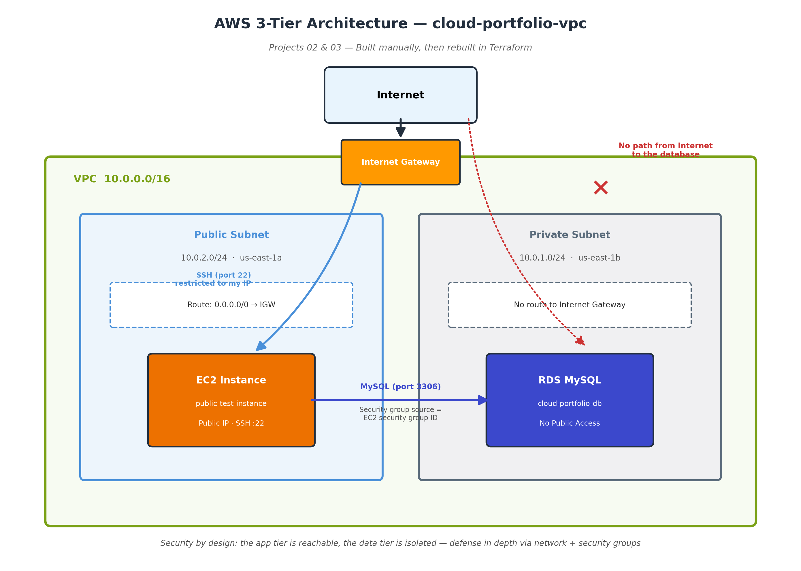

# Project 02 - AWS 3-Tier Architecture (Manual Console Build)

## Business problem this solves
A data breach is not an IT headache, it is a company-ending event — the average one costs $4.9M (IBM), and most small companies fold within six months of one. Locking the database in a private subnet means it is simply unreachable from the internet. Cheapest insurance a business will ever buy.

## What I built
A complete, tested AWS network built entirely by hand in the AWS console — no automation tools, just understanding each piece before writing code for it.

### Architecture
- **VPC:** `cloud-portfolio-vpc` — CIDR `10.0.0.0/16`
- **Public subnet:** `public-subnet-1` — CIDR `10.0.2.0/24` — AZ `us-east-1a`
- **Private subnet:** `private-subnet-1` — CIDR `10.0.1.0/24` — AZ `us-east-1b`
- **Private subnet 2:** `private-subnet-2` — CIDR `10.0.3.0/24` — AZ `us-east-1c`
- **Internet Gateway:** attached to VPC, enables public internet access
- **Route table:** routes `0.0.0.0/0` to IGW, associated with public subnet only
- **EC2 instance:** in public subnet, SSH accessible, tested live
- **RDS MySQL database:** in private subnets, no public access, only reachable from EC2

## Why I built it manually first
Before writing Terraform code for infrastructure, I needed to understand what each piece actually does and why it exists. If you write Terraform without understanding VPCs, you're just copying code you don't understand — that falls apart in interviews and on the job.

## Why public vs private subnets
The web/app tier (EC2) sits in the public subnet — reachable from the internet for legitimate traffic. The database (RDS) sits in the private subnet — no public IP, no internet gateway route, only reachable from inside the VPC. This separation is the most fundamental security boundary in cloud architecture. If the database were public, one misconfigured security group rule away from being exposed to the internet.

## Real problems I ran into
- **CIDR overlap error:** When creating the second subnet, I got `CIDR Address overlaps with existing Subnet CIDR`. Had to check what was already created, realize my first subnet landed on `10.0.2.0/24` instead of `10.0.1.0/24`, and adjust the second one accordingly. Classic real-world debugging — check what actually exists before assuming
- **Wrong master username:** Spent 2 hours trying to connect to RDS with username `admin`. The actual username was `adminME`. Fixed by checking the actual field value in the RDS console instead of assuming. Lesson: never assume, always verify
- **EC2 IP address changing:** After stopping and restarting the EC2 instance, the public IP changed. Had to grab the new IP from the console each time. Real fix: Elastic IP addresses (covered in a future project)
- **vim vs nano confusion:** Git dropped me into vim for a merge commit message. Didn't know the difference between Insert mode and Normal mode. Learned `:wq` to save and quit after several failed attempts with Ctrl+O
- **Git merge conflict:** Local and remote branches diverged. Had to `git pull`, resolve the merge, then push. Normal part of real team workflows

## End-to-end connectivity test
1. SSH'd into `public-test-instance` from local Mac terminal
2. Ran `ping google.com` — confirmed outbound internet access from public subnet
3. Installed MySQL client on EC2 instance
4. Connected to RDS database using its internal endpoint
5. Reached `MySQL [(none)]>` prompt — proving public subnet can reach private database, internet cannot

## What this actually taught me

Building this by hand before writing any Terraform code was the right call. When I later wrote `vpc_id = aws_vpc.main.id` in Terraform, I knew exactly what that line was doing — linking a subnet to a specific VPC — because I'd already done that same action manually in the console. Without the manual build first, that line would just be something I copy-pasted without understanding.

The private subnet decision wasn't just "best practice" — it was a deliberate architectural choice. Putting RDS in a private subnet means there are two independent layers of protection: the security group (which controls what traffic is allowed) AND the network layer (which controls whether a network path even exists). If I only used a security group and accidentally left port 3306 open to the world, the database would be exposed. With a private subnet, that mistake still can't expose it — there's no route to get there from the internet in the first place. That's defense in depth, not just a checkbox.

The most valuable thing I learned wasn't the architecture — it was the debugging. Wrong username, CIDR conflicts, IP addresses changing, merge conflicts. Real cloud engineering is mostly diagnosing why something isn't working, not building things that work perfectly the first time.

## What I'd add next
- NAT Gateway so private subnet instances can reach the internet for updates without being publicly accessible
- Application Load Balancer in front of EC2
- Rebuild entirely in Terraform (see Project 03)

# Project 02 - AWS VPC Networking

A custom AWS VPC built by hand in the console to demonstrate core networking concepts: public/private subnet separation, internet routing, and connectivity testing.

## Architecture

- **VPC:** `cloud-portfolio-vpc` — CIDR `10.0.0.0/16`
- **Public subnet:** `public-subnet-1` — CIDR `10.0.2.0/24` — AZ `us-east-1a`
- **Private subnet:** `private-subnet-1` — CIDR `10.0.1.0/24` — AZ `us-east-1b`
- **Internet Gateway:** `cloud-portfolio-igw` — attached to the VPC
- **Route table:** `public-route-table` — routes `0.0.0.0/0` to the Internet Gateway, associated with `public-subnet-1`

## What it demonstrates

- VPC and subnet design with non-overlapping CIDR blocks
- Public vs. private subnet separation — a core security pattern (web-facing resources in public, sensitive resources like databases kept private)
- Spreading subnets across multiple Availability Zones for fault tolerance
- Internet Gateway + route table configuration to enable outbound internet access
- Security group configuration restricting SSH access to a specific IP
- End-to-end connectivity testing: SSH into a live EC2 instance in the public subnet, then verified outbound internet access via `ping`

## How it was tested

1. Launched a `t3.micro` EC2 instance (`public-test-instance`) inside `public-subnet-1` with a public IP enabled
2. SSH'd into the instance from a local machine using a key pair
3. Ran `ping google.com` from inside the instance to confirm outbound internet connectivity

## Next steps

- Add an RDS database inside `private-subnet-1`, accessible only from the public subnet (not directly from the internet)
- Rebuild this entire setup using Terraform (Infrastructure as Code) instead of manual console steps
## Database Layer (RDS)

- **Database:** `cloud-portfolio-db` — MySQL, free-tier instance
- **DB subnet group:** `private-db-subnet-group` — spans `private-subnet-1` (us-east-1b) and `private-subnet-2` (us-east-1c)
- **Security group:** `db-security-group` — inbound rule allows MySQL (port 3306) only from the EC2 instance's security group, not from any IP range
- **Public access:** Disabled — the database has no public IP and no internet gateway route, making it unreachable from outside the VPC entirely

## End-to-End Connectivity Test

1. SSH'd into `public-test-instance` (in `public-subnet-1`) from a local machine
2. Installed the MySQL client (`mariadb105`) on the instance
3. Connected from the EC2 instance to the RDS database using its internal endpoint
4. Successfully authenticated and reached a `MySQL [(none)]>` prompt — confirming the public subnet can reach the private database, while the open internet cannot

This proves the core 3-tier security pattern: web/app tier is reachable from the internet, data tier is reachable only from inside the VPC.
## Next steps

- Rebuild this entire setup using Terraform (Infrastructure as Code) instead of manual console steps

