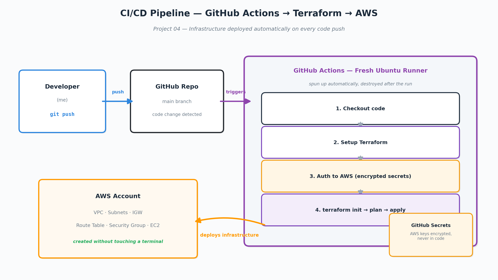

# Project 04 - CI/CD Pipeline with GitHub Actions

## What I built
An automated pipeline that triggers every time code changes are pushed 
to the `03-terraform-vpc/` folder. GitHub spins up a fresh Ubuntu server, 
installs Terraform, authenticates to AWS using encrypted secrets, and 
runs terraform init, plan, and apply automatically.

## Why this matters
Manual terraform apply from a laptop means only one person can deploy, 
mistakes happen from wrong directories or accounts, and there's no audit 
trail. A pipeline means every infrastructure change goes through the same 
automated process, triggered by a code push, logged in GitHub history.

## Real problems I hit
- **Wrong token scope:** Personal Access Token didn't have `workflow` 
  scope — GitHub rejected the push of the workflow file. Had to generate 
  a new token with the right permissions.
- **Secrets named wrong:** Named the GitHub secret `AWS` instead of 
  `AWS_ACCESS_KEY_ID`. Pipeline failed with a credentials error that 
  didn't directly say "wrong secret name" — had to connect the dots 
  between the error message and the actual cause.
- **State divergence:** Pipeline created real AWS resources using a 
  temporary state file that disappeared after the run. Local Terraform 
  had no record of those resources. Led directly to building Project 05.

## The pipeline file
Located at `.github/workflows/terraform.yml` in the root of this repo.

## Why the state problem matters
This project intentionally exposed a real production problem — CI/CD 
pipelines and local Terraform can't share state without a remote backend. 
The fix is Project 05.
