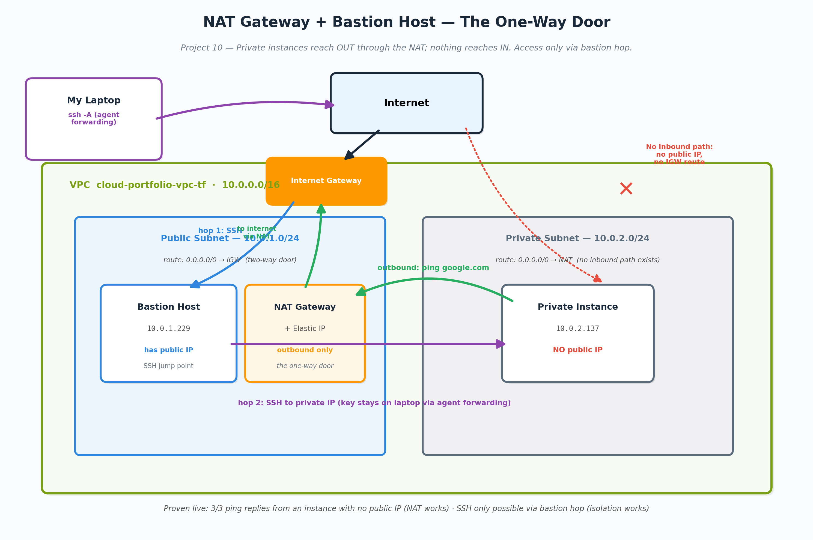

# Project 10 - Networking Depth: NAT Gateway & Bastion Host

## Business problem this solves
Unpatched servers are how most breaches get in, and a breach averages $4.9M. The NAT lets locked-down private servers pull their security updates automatically without opening a single door inward. And since a NAT bills by the hour, I tore mine down after testing — the same habit that keeps a cloud bill from quietly doubling.

## What I built
The "one-way door" for private infrastructure: a NAT Gateway that lets
private subnet instances reach OUT to the internet (for updates and
downloads) while keeping them completely unreachable from outside —
plus a bastion host pattern to access those private instances the way
engineers do in production.

## The core concept: routing IS the security boundary
A subnet isn't inherently public or private — the route table makes it
one or the other:

| Subnet  | Route for 0.0.0.0/0     | Result                                  |
|---------|-------------------------|-----------------------------------------|
| Public  | → Internet Gateway      | Two-way: reachable and can reach out    |
| Private | → NAT Gateway           | One-way: outbound only, no inbound path |

Give a "private" subnet a route to the Internet Gateway and it is, by
definition, public now. The label is just a name; the routing is the
reality.

The NAT Gateway itself lives in the PUBLIC subnet (it needs its own
road to the internet to forward traffic) — a classic interview trip-up
question.

## What I proved, live
1. **No inbound path exists:** the private instance has no public IP
   at all — there is literally nothing for the internet to connect to
2. **Outbound works through the NAT:** from the private instance,
   `ping google.com` returned 3/3 replies (~2.5ms) — a machine with no
   public address reached the internet through the one-way door
3. **Bastion access works:** reached the private instance via a
   two-hop SSH — laptop → bastion (public subnet) → private instance —
   using SSH agent forwarding (`ssh -A`) so my private key never left
   my laptop. Copying keys onto a bastion is bad practice; agent
   forwarding is the professional pattern.

## Real problems I hit (the best part)
- **The ghost VPC.** The instance launcher showed TWO VPCs with the
  identical name `cloud-portfolio-vpc-tf`. Root cause traced back to
  Project 04/05: my CI/CD pipeline ran terraform apply with its own
  temporary state while my laptop had separate local state — two
  applies, two states, two identical VPCs. The state divergence
  problem I documented in Project 05 had left physical evidence I was
  now tripping over. Remote state exists precisely to prevent this.
- **Bastion launched into the wrong subnet — twice.** First launch
  landed in the default VPC entirely (the VPC dropdown defaults there;
  the giveaway was a 172.31.x.x private IP instead of 10.0.x.x).
  Second launch landed in the private subnet with a public IP — a
  combination that fails silently: inbound SSH arrives, but replies
  route out through the NAT and get dropped. No error, just an
  eternal hang.
- **Elastic IP wouldn't release during cleanup** — "Cannot be released
  with association IDs." Order of operations matters: the NAT Gateway
  holds the EIP, so the NAT must be fully deleted first, then the EIP
  releases cleanly.

## Lessons that stuck
- Network misconfigurations fail SILENTLY. Wrong route table = SSH
  hangs with no error. Same pattern as my CloudWatch project (wrong
  metric = flat-zero graph, no error). Verify with live tests; never
  trust "it saved without errors."
- The private IP prefix is an instant diagnostic: 10.0.1.x = my public
  subnet, 10.0.2.x = my private subnet, 172.31.x.x = oops, default VPC.
- NAT Gateways cost real money (~$0.045/hr + data) — a known AWS bill
  pain point. Built it, proved it, destroyed it same session, and
  released the Elastic IP (unattached EIPs also bill).

## Cleanup
Terminated both instances, deleted the NAT Gateway, released the
Elastic IP. Route table retained (free, documents the design).

## What's next
- Application Load Balancer (its own session — target groups, listeners,
  health checks)
- Delete the orphan duplicate VPC left behind by the state divergence
