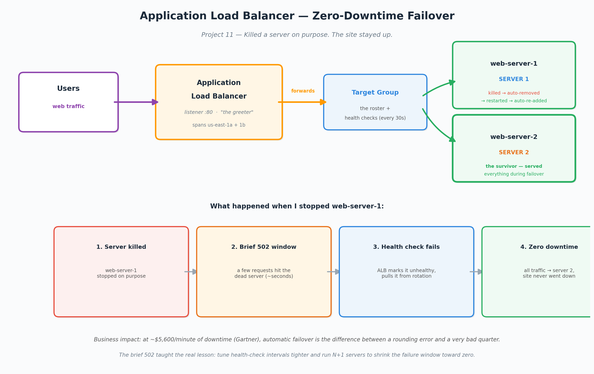

# Project 11 - Application Load Balancer: Zero-Downtime Failover

## Business problem this solves
One server is one point of failure. When it dies, the whole site goes
down — and at an average of ~$5,600 per MINUTE of downtime (Gartner),
a single crash at 2am is a five-figure event plus an engineer dragged
out of bed. A load balancer across multiple servers means one dying is
a non-event: traffic reroutes to the survivors automatically, nobody
gets paged, customers never notice. That's the difference between a
rounding error and a very bad quarter.

## What it is (plain version)
Picture a restaurant with one cashier — if that cashier faints, the
whole line stops and customers leave. Now add a greeter at the door
who points each customer to a free cashier and checks every few seconds
that each one is still standing. If one faints, the greeter just stops
sending people there. Nobody notices.

- **Application Load Balancer** = the greeter
- **Target group** = the cashier roster (+ the health checks)
- **Listener** = the front door on port 80
- **Health check** = the "you good?" tap every 30 seconds

## What I built
- Two EC2 web servers, each auto-configured on boot via user-data to
  serve a page identifying itself (SERVER 1 / SERVER 2) so traffic
  distribution is visible
- A target group (HTTP/80) with both servers registered and health
  checks on `/`
- An internet-facing Application Load Balancer spanning two
  Availability Zones, with a listener on port 80 forwarding to the
  target group
- Confirmed live: refreshing the ALB's URL alternated between SERVER 1
  and SERVER 2 — real traffic distribution

## Proving failover (killed a server on purpose)
I stopped web-server-1 while refreshing the ALB URL:
1. For a few seconds, some requests hit the dead server — a brief 502
   Bad Gateway, because the health check hadn't caught it yet
2. Within ~30 seconds the health check failed enough times, the ALB
   marked web-server-1 unhealthy and pulled it from rotation
3. Every request after that served from web-server-2 — the site stayed
   up
4. I restarted web-server-1; the health check passed and the ALB
   automatically added it back to rotation

The site survived a server death with no human intervention.

## Real problems I hit
- **HTTP port closed.** First page load just spun forever. The security
  group allowed SSH but not HTTP — I'd swapped the rule instead of
  adding to it. Security groups are per-port doorways: port 22 open
  does not mean port 80 open. Added the HTTP rule, page loaded. ("It
  hangs" -> check the security group -> wrong port -> fix — a very
  common real ticket.)
- **ALB needs two AZs.** An ALB requires subnets in at least two
  Availability Zones, but both my servers lived in one public subnet.
  Created a second public subnet in us-east-1b and associated it with
  the public route table (the one with the Internet Gateway route) to
  make it genuinely public.
- **Target group protocol-version mismatch.** The first target group
  was created as HTTP2, so it never appeared in the listener's forward
  dropdown. The listener expected HTTP1. Recreated the target group as
  HTTP1 and it wired up immediately. The console filters silently — no
  error, just an empty dropdown.

## The lesson (why the 502 matters)
The brief 502 window isn't a flaw to hide — it's the health-check
interval made visible. There's always a gap between "server dies" and
"load balancer notices," equal to the check interval. In production you
shrink that gap: tighter health-check intervals, connection draining,
and N+1 redundancy so there's always spare capacity. A clean demo that
never showed the 502 would have taught me less.

## What I'd do differently for real HA
Both servers ran in one AZ for this demo. For true high availability
I'd spread them across both AZs the ALB spans, so an entire data center
failing still leaves a healthy server. Pairing this with an autoscaling
group (scale out at 70% CPU, in at 40%) would also handle traffic
spikes automatically and cut cost versus running fixed capacity 24/7.

## Cleanup
Stop/terminate the two web servers, delete the ALB, delete both target
groups (the orphaned HTTP2 one included). The second public subnet and
route association can stay — they cost nothing and improve the VPC.
