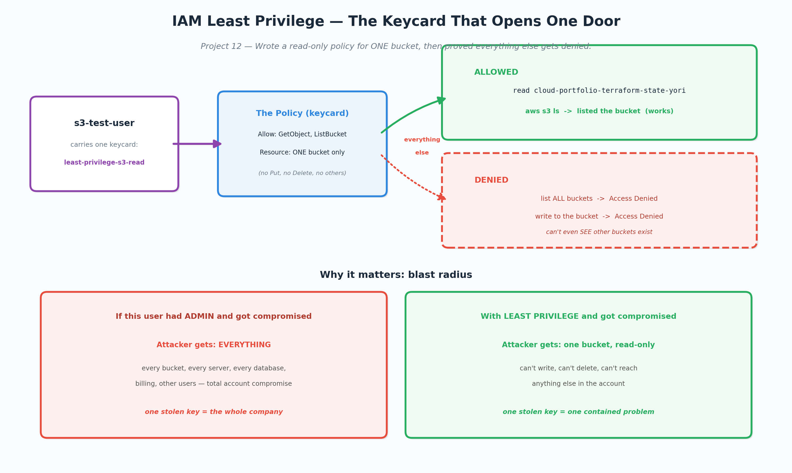

# Project 12 - IAM Policy Design: Least Privilege in Practice

## Business problem this solves
Almost every breach post-mortem finds the same thing: an account that
had far more access than it needed. When something gets compromised —
a leaked key, a phished password — the damage is only as big as what
that account could reach. Over-permissioned accounts turn a small
break-in into a company-ending event ($4.9M average breach, IBM).
Least-privilege access is the cheapest insurance there is: it costs
nothing to write a tight policy, and it's the difference between an
attacker getting one read-only bucket versus your entire environment.

## What it is (plain version)
IAM is the security desk that hands out keycards. A bad keycard opens
every door in the building — steal it once and the whole place is
exposed. A good keycard opens only the doors that person actually needs.
That "only what you need, nothing more" rule is least privilege, and
it's the single most important idea in cloud security.

- **IAM user / role** = the person or system getting a keycard
- **IAM policy** = the keycard's permissions, written as JSON
- **Effect / Action / Resource** = the whole language: Allow or Deny,
  which actions, on which resources

## What I built
A least-privilege IAM policy, written by hand in JSON, that grants
read-only access to exactly ONE S3 bucket and nothing else:
- **Action:** only `s3:GetObject` and `s3:ListBucket` (read + list — no
  write, no delete)
- **Resource:** one specific bucket ARN, not the `*` wildcard that most
  default policies use

Then I created a test user, attached only this policy, generated CLI
credentials, and set it up as a separate profile to test as that user
without touching my admin credentials.

## Proving the boundary (the whole point)
Three commands, run as the restricted user:

1. **List the allowed bucket** -> WORKED. Returned the bucket contents.
   The keycard opens its one door.
2. **List ALL buckets in the account** -> ACCESS DENIED. The policy
   never granted `s3:ListAllMyBuckets`, so the user can't even see that
   other buckets exist.
3. **Write a file to the allowed bucket** -> ACCESS DENIED. Read access
   was granted, but not `s3:PutObject`. It can read the bucket, not
   change it.

Two denials and one success — the least-privilege boundary made visible
and enforced by AWS automatically.

## Real problem I hit
My first test denied EVERYTHING, including the bucket the user was
supposed to be able to read. The error said "no identity-based policy
allows the s3:ListBucket action." I diagnosed it by checking the user's
Permissions tab — it was empty. The policy had been created but never
actually attached to the user.

That taught me a core security principle: **IAM is deny-by-default.** A
user with no policies can do nothing at all — AWS assumes zero access
until a policy explicitly grants it. It also taught me that "access
denied" has two distinct causes: the policy is missing entirely, or the
policy is attached but doesn't cover that specific action. Checking the
Permissions tab tells you which. Attaching the policy fixed it, and the
allowed action immediately worked.

## Why this matters: blast radius
The reason least privilege exists is containment. When (not if)
something gets compromised, you want the damage boxed into one small
area instead of spreading across everything.

- **If this user had admin and got compromised:** the attacker gets
  every bucket, every server, every database — total account
  compromise. One stolen key = the whole company.
- **With least privilege:** the attacker gets one bucket, read-only.
  Can't write, can't delete, can't reach anything else. One stolen key
  = one contained problem.

## Security discipline note
The CLI access key I generated to test this is a password. Real secret
keys never get pasted anywhere but the credentials prompt, and anything
exposed gets rotated immediately. As cleanup, I deleted the test user's
access key entirely — an exposed or unused credential is attack surface
with no upside.

## Cleanup
Deleted the test user's access key; the test user and policy can stay
as documentation (they cost nothing and grant nothing dangerous).

## What's next
- Attach least-privilege policies to roles (for services like Lambda)
  instead of users — which sets up the serverless project
- Write a policy that scopes access by tags or conditions (e.g. only
  resources tagged for a specific project)
