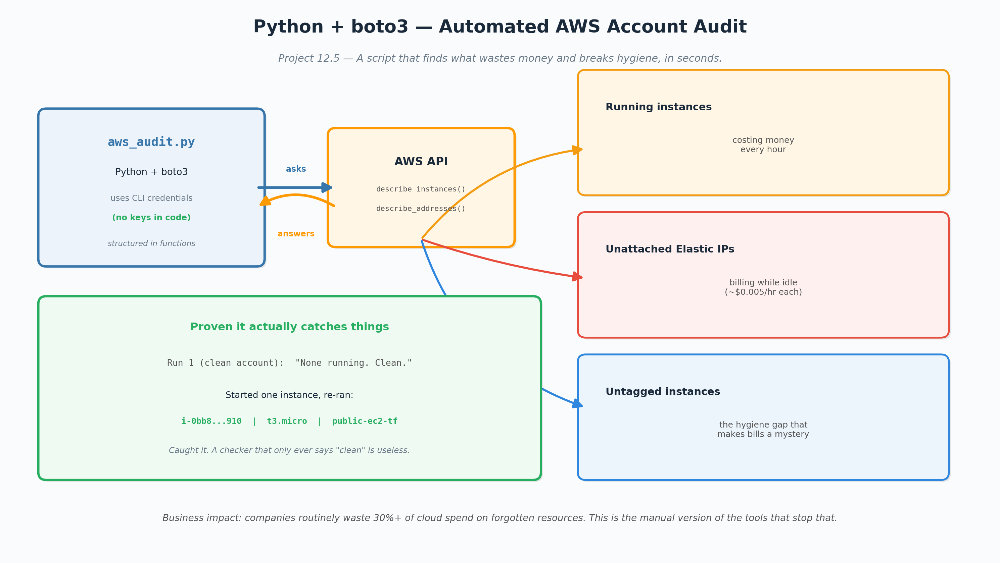

# Project 12.5 - Python + boto3: Automated AWS Account Audit



## Business problem this solves
Companies routinely waste 30%+ of their cloud spend on resources nobody
remembers leaving on — a server that was "just for testing," an Elastic
IP reserved and forgotten, untagged resources that make the bill
impossible to explain. Clicking through the console to find them by hand
doesn't scale. A script that audits the whole account in seconds turns
"why is our AWS bill so high?" from a mystery into a one-command answer.
This is the manual version of the cost-governance tools that big teams
pay for.

## What I built
A Python script (`aws_audit.py`) using boto3 (the AWS SDK for Python)
that audits an AWS account for three common cost-and-hygiene problems:

1. **Running EC2 instances** — anything turned on is billing by the hour
2. **Unattached Elastic IPs** — AWS charges for reserved IPs that aren't
   attached to anything (idle waste)
3. **Untagged instances** — resources with no Name tag, the hygiene gap
   that makes cloud bills impossible to trace back to a purpose

It prints a clean report, one section per check.

## How it works (plain version)
The script is an automatic inspector. Instead of me clicking through the
console checking each thing by hand, it asks AWS all these questions
programmatically and prints the answers in seconds.

- `import boto3` — the library that lets Python talk to AWS
- `boto3.client('ec2', ...)` — opens a connection to the EC2 service.
  **No keys in the code** — it uses the credentials already configured
  in my environment, which is the secure way
- `describe_instances()` / `describe_addresses()` — the actual AWS calls
- Each check is its own function, so adding new checks later is easy —
  readable, maintainable code rather than one long script

## Proving it actually catches things
A checker that only ever prints "clean" is useless — you have to prove
it flags real findings.

- **First run (cleaned-up account):** "None running. Clean." across all
  three checks
- **Then I started an existing instance and re-ran it:** the script
  immediately flagged `public-ec2-tf` (a Terraform-created t3.micro) in
  the running-instances section

It caught a real resource the moment one existed — and notably caught a
Terraform-provisioned instance, showing the audit works regardless of
how a resource was created.

## Engineering practices used
- **Virtual environment (venv):** dependencies isolated to this project
  instead of installed system-wide, so they never pollute the system
  Python. This is the standard, professional way to structure a Python
  project
- **requirements.txt:** pinned dependency versions so anyone can
  reproduce the exact environment with `pip install -r requirements.txt`
- **Credentials from the environment, never hardcoded** — no secret keys
  live in the script

## Why this matters for the role
Almost every cloud/DevOps posting lists "Python or Bash scripting." This
is the Python half, applied to something real: cost governance and
account hygiene, which the market increasingly rewards. It also
demonstrates the boto3 automation pattern that underpins most serious
AWS tooling.

## How to run it
```
python3 -m venv venv
source venv/bin/activate
pip install -r requirements.txt
python aws_audit.py
```

## What I'd add next
- Loop across all regions (currently checks us-east-1) — forgotten
  resources love hiding in regions nobody looks at
- Flag EBS volumes not attached to any instance (another silent cost)
- Output to CSV or JSON so results can feed a dashboard or a scheduled
  Lambda that emails a weekly report
