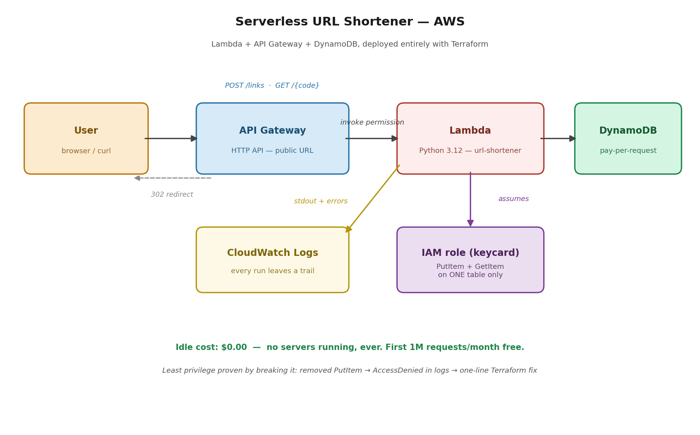

# Project 13 — Serverless URL Shortener (Lambda + API Gateway + DynamoDB)

A working URL shortener running live on AWS with zero servers. POST a long URL, get back a short code. Hit the short link, get redirected. The whole thing — database, function, permissions, public API — is defined in Terraform and deployed from code. Nothing was clicked together in the console.

**Live demo:** `curl -X POST <api-url>/links -d '{"url": "https://example.com"}'` → `{"short_code": "0XJehA"}` → opening `<api-url>/0XJehA` in a browser redirects you there.

## Why serverless matters (the business case)

Every project I'd built up to this point ran on EC2 — servers that bill you 24/7 whether anyone's using them or not. A t3.micro sitting idle still costs roughly $8–10/month, and idle capacity is one of the biggest sources of cloud waste (it's exactly what my boto3 audit script in Project 12.5 hunts for — unattached EIPs, forgotten instances).

This stack inverts that. At zero traffic it costs $0.00. Lambda's free tier covers the first million requests every month, and DynamoDB in pay-per-request mode only charges when something is actually read or written. The same architecture that costs nothing at idle will also absorb a traffic spike to thousands of requests without me provisioning anything. Scale to zero AND scale up — that's the trade you're making when you go serverless, and knowing when it's the right trade (spiky or unpredictable traffic) versus wrong (steady heavy load, long-running processes) is the actual skill.

## How it works

1. **API Gateway (HTTP API)** owns the public URL and two routes: `POST /links` and `GET /{code}`. It's the front door — it matches the route and forwards the whole request to Lambda.
2. **Lambda (Python 3.12)** wakes up, reads the request, and either writes a new short code to the table (POST) or looks one up and returns a 302 redirect (GET). It goes back to sleep the moment it's done. The DynamoDB connection is created outside the handler so warm invocations reuse it instead of reconnecting every time.
3. **DynamoDB** stores the mappings. Partition key is `short_code`, so lookups are single-digit milliseconds regardless of table size. No capacity planning, no MySQL patching like my RDS build in Project 2.
4. **IAM role** — the part I'm most deliberate about. The Lambda's role allows exactly two actions, `dynamodb:PutItem` and `dynamodb:GetItem`, on exactly one resource: this table's ARN. Not `dynamodb:*`, not `Resource: *`. Deny-by-default, same principle I proved in Project 12. With the average breach now costing $4.9M (IBM), scoping permissions this tightly isn't paranoia — it's the cheapest insurance in the building.

## I broke it on purpose. Twice.

Building things that work is table stakes. I wanted the troubleshooting stories, so I engineered two failures — and they fail in completely different places, which turned out to be the real lesson.

### Break #1: revoked the write permission

I removed `dynamodb:PutItem` from the IAM policy and applied. Reads kept working. Writes returned a generic `{"message": "Internal Server Error"}` — useless to a user, and by design: you never leak internals to the public.

Instead of guessing, I pulled the Lambda's CloudWatch logs (`aws logs tail /aws/lambda/url-shortener --since 10m`). The error was surgically specific: the assumed role `url-shortener-lambda-role` was not authorized to perform `dynamodb:PutItem` on my table's exact ARN, "because no identity-based policy allows the action." Who tried, what action, which resource, and why it was refused — all in one line, with a traceback pointing at line 17 of my function.

The fix was a one-line diff in Terraform, reviewed and applied. Total time from "it's broken" to root cause: under two minutes, because logging and least privilege were already in place. Bonus finding in the same logs: I watched a real cold start happen — 573ms of init before my code even ran — and confirmed the function peaks at 94MB of its 128MB allocation, so it's not over-provisioned.

### Break #2: removed API Gateway's permission to invoke the Lambda

This is the sneaky one, and it's a failure mode I now know cold because I've lived it. I commented out the `aws_lambda_permission` resource — the explicit grant that lets API Gateway wake the function — and applied.

Same symptom from the outside: 500 Internal Server Error. But this time the Lambda logs were **empty**. No INIT, no START, nothing. And that silence is the diagnostic: the request never reached the function. The failure was upstream, at the front door. API Gateway asked to invoke the Lambda, got refused, and gave up.

Two identical 500s, two completely different root causes, and the difference between them is whether the logs have a traceback or nothing at all. If someone asks "your Lambda works when you test it directly but fails through API Gateway — why?", this missing invoke permission is the answer nine times out of ten.

## What I'd do differently at production scale

- **Enable API Gateway access logging.** Break #2 taught me that Lambda logs go silent when the failure is upstream — production needs eyes on the front door too, not just the kitchen.
- **Add a TTL attribute** so old links expire automatically instead of accumulating forever. DynamoDB deletes expired items for free.
- **Custom domain via Route 53** with an alias record, instead of the raw execute-api URL — nobody's putting `83rxnc116g.execute-api...` on a business card.
- **Idempotency and collision handling** — `secrets.token_urlsafe(4)` gives ~16.7M combinations, fine for a demo, but at scale I'd check for collisions on write or lengthen the code.

## PSIL

**Problem:** Always-on infrastructure bills for idle time. Traditional server-based apps cost money 24/7 at 0% utilization, and every server is also a patching and scaling burden.

**Solution:** A fully serverless API — API Gateway routing to a Python Lambda backed by DynamoDB — deployed entirely with Terraform, with an IAM role scoped to exactly two actions on exactly one table.

**Impact:** $0.00 idle cost versus ~$100+/year for even the smallest always-on instance, with capacity that scales automatically in both directions. When I deliberately broke it, root cause took under two minutes from CloudWatch logs, and least privilege kept the blast radius to a single action — reads never went down.

**Learning:** Two failures can look identical from the outside and be completely different underneath. A traceback in the logs means the failure is inside your function; silence means it never got there. Show users generic errors, keep the precise ones in your logs, and fix everything in code — never in the console.
