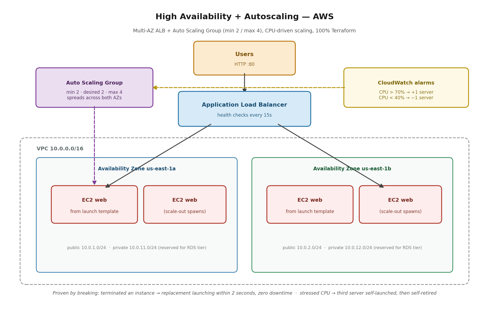

# Project 13.5 — High Availability + Autoscaling (Multi-AZ ALB + ASG)

**The problem:** A company runs its web app on a fixed pair of servers. Traffic spikes overwhelm them on the best sales days, quiet hours still bill for full capacity, and a single data-center outage takes everything down. Capacity needs to follow demand, and the architecture needs to survive losing an entire building — without a human touching anything.

**Requirements:**
- Survive the loss of one Availability Zone with zero manual action
- Scale out when average CPU exceeds 70%; scale in below 40%
- No capacity change ever requires a human
- Failed servers replace themselves
- Everything in Terraform; every behavior proven by deliberately breaking it

## What this demonstrates

An Application Load Balancer spanning two AZs, fronting an Auto Scaling Group (min 2, max 4) that launches identical servers from a launch template. CloudWatch alarms watch fleet-average CPU and drive scale-out/scale-in policies. Two security groups chained so instances accept traffic only from the load balancer — never directly from the internet.

I proved every requirement by attacking it:

**Kill test:** I terminated a running instance. The ASG detected the death and began launching a replacement **within 2 seconds** (Activity log: takeout at 04:24:13Z, replacement launch at 04:24:13Z). The load balancer used connection draining — no new traffic to the dying server, in-flight requests allowed to finish. curl requests during the entire event never failed; the survivor absorbed everything. The replacement launched into the same AZ as the casualty, automatically restoring the two-building spread.

**Spike test:** I pinned CPU at 100% with a stress tool. After two consecutive hot minutes the high-CPU alarm fired and the ASG launched a third server, citing the alarm by name in its activity log. When the stress ended and average CPU collapsed, the low-CPU alarm retired the extra server — and then kept voting to shrink further, losing to `min_size = 2` every time. The floor held against the thermostat, which is exactly the design.

## Decisions and trade-offs

**Launch template + ASG, not hand-defined instances.** My earlier ALB project declared two `aws_instance` blocks — servers I personally hired by name. An ASG can't manage named employees; it stamps out interchangeable ones from a job description. Cattle, not pets: the servers in this build have no names in the code at all, and that's the point. Anything configured by hand on a running instance dies with it — so all setup lives in the template's user-data script. Never fix a server; fix the template and replace the server.

**User-data script, not a baked AMI.** Every fresh server installs Apache on boot, in plain sight in the repo. The alternative — baking a golden AMI with Packer — boots faster and wins in production where install latency during a spike matters. The script wins here: simpler, no image pipeline, and the setup is readable. I'd say it in one line: user data for simplicity, golden AMIs when boot latency matters.

**min_size = 2, not 1.** One server is cheaper — and silently deletes the availability requirement, because one server means one AZ. Two across two AZs is the minimum where "survives a building loss" stays true at the quietest hour. High availability has a floor price; this is it.

**Scaling on CPU, not requests-per-target.** CPU fit this lab because the stress test manipulates CPU directly. But CPU lies for I/O-bound apps: a server waiting on slow database queries idles at 15% CPU while requests pile up and users time out. Request count per target catches that; CPU doesn't. Rule: CPU for compute-heavy workloads, request count for typical web apps.

**Step scaling with explicit alarms, not target tracking.** I wired alarm → policy → ASG by hand to expose the mechanism. In production I'd default to target tracking ("hold average CPU near 50%") — one block, AWS manages the alarms. I built the manual version to understand what target tracking automates.

**Alarm patience: 2 evaluation periods + 120s cooldown.** Trigger instantly and a 30-second traffic blip hires a server you fire two minutes later — a thermostat mounted next to the oven. The delay trades responsiveness for stability.

**Two AZs, not one or three.** One AZ fails the requirement. Three is what payment-processor SLAs buy — surviving two simultaneous failures — at meaningfully higher cost. Two delivers the headline capability for this workload.

**Instances in public subnets (lab), private in production.** Honest shortcut: private subnets require a NAT gateway (~$32/month + data) for a short-lived lab. The security posture survives because of security-group chaining — the web servers accept port 80 only from the ALB's security group, so they're unreachable directly even with public IPs. At production scale, instances move to private subnets behind NAT, full stop.

## What broke (three stories, all kept)

**1. The blank AZ in the demo page.** My user-data script queried the instance metadata service the old way (IMDSv1). Amazon Linux 2023 enforces IMDSv2 — session-token required — so the call silently returned empty and pages rendered "in " with no zone name. The instance IPs proved the AZ anyway (10.0.1.x = 1a, 10.0.2.x = 1b). Lesson: newer AMIs enforce IMDSv2 by default and legacy metadata one-liners fail silently, not loudly.

**2. My own security group locked me out.** EC2 Instance Connect failed against the web servers — because their security group allows exactly one thing: port 80 from the ALB's group. SSH from anywhere isn't on the guest list, including mine. The failure was the security design working. Fix: a temporary standalone rule allowing port 22 from Instance Connect's published IP range only (never 0.0.0.0/0), deleted in code after the test. Production answer: SSM Session Manager — no open SSH port at all, access governed by IAM.

**3. Two bookkeepers, one ledger.** Deleting that temporary rule threw `InvalidPermission.NotFound` mid-apply. Root cause: I'd mixed inline security-group rules (defined inside the SG resource) with a standalone rule resource on the same group — a documented Terraform anti-pattern. Both constructs think they own the SG's rule list; the standalone rule's deletion succeeded, then the inline definition tried to revoke the same already-gone rule. A state refresh reconciled it. Rule going forward: all-inline or all-standalone per security group, never both.

## What I'd change at production scale

Move instances to private subnets behind per-AZ NAT gateways (a NAT failure in one zone shouldn't strand the other). Switch to target-tracking scaling. Scale on ALB request count per target rather than CPU for this workload type. Add the RDS Multi-AZ tier in the reserved private subnets — synchronous standby in the second AZ, automatic failover. Bake a golden AMI once boot latency starts costing conversions during spikes. Enable ALB access logs to S3.

## Security · Monitoring · Cost

**Security:** deny-by-default security groups chained ALB→instance; no SSH in steady state; the one temporary access rule was scoped to a /29 service range and removed in code. **Monitoring:** CloudWatch alarms are not just alerting here — they're the control loop that drives capacity; the fleet-average subtlety (one hot server ≈ 50% average) is why load tests must stress the fleet, not a box. **Cost:** capacity follows demand — fixed fleets pay for peak 24/7; this design pays for peak only during peaks, the ~40% saving autoscaling exists to capture. The entire lab ran ~2 hours and was destroyed in code: the deliverable is the repo, not a running bill.

## PSIL

**Problem:** Fixed-capacity infrastructure fails both directions — drowns during spikes, burns money during quiet — and a single-AZ deployment means one data-center outage is a total outage.

**Solution:** Multi-AZ ALB + Auto Scaling Group from a launch template, CPU-alarm-driven scaling policies, chained security groups, 100% Terraform.

**Impact:** Instance death detected and replacement launching within 2 seconds, zero failed requests during the event. Demand spike self-staffed a third server; quiet self-retired it; min-capacity floor held. Autoscaling versus fixed capacity is the ~40% cost lever, with downtime avoidance on top of it (Gartner pegs downtime at $5,600/minute).

**Learning:** Autoscaled servers must be disposable — setup lives in the template, never on the box. Alarms watch the fleet average, not any single server. And two of my three failures were my own security controls and IaC discipline working as designed — which is what "break it on purpose" is for.
