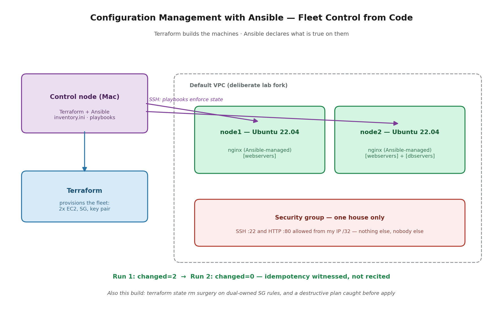

# Project 14 — Configuration Management with Ansible (Linux Fleet Control)

**The problem:** A company runs a fleet of Linux servers configured by hand. Every server was set up by whoever SSH'd in that day — server #4 is subtly different from server #2 and nobody knows why. Setup knowledge lives in a stale wiki page. Config drift is invisible until it causes an outage. The company needs server configuration that is written down, repeatable, enforced across the fleet, and safe to re-apply at any time.

**Requirements:**
- Fleet provisioning fully in Terraform; configuration fully in Ansible — no hand-setup anywhere
- One playbook configures every server in a group identically
- Re-running configuration must be safe: enforce state, never blindly repeat steps
- Access locked to a single trusted IP — the lab equivalent of zero unnecessary exposure
- Entire environment destroyable and rebuildable from code in minutes

## What this demonstrates

Terraform provisions a two-node Ubuntu 22.04 fleet (EC2, key pair, security group scoped to my IP /32 only — one house, not one neighborhood). Ansible then takes over the layer Terraform doesn't touch: what's true *on* the machines. An inventory file defines role-based groups (`webservers`, `dbservers`); a playbook declares desired state — nginx installed, a custom page deployed, the service running and enabled — and one command enforces it across the fleet.

The division of labor is the lesson: **Terraform declares what machines exist; Ansible declares what is true on them.** Same declarative philosophy, different layer. Launch-time setup belongs in user data (Project 13.5); ongoing state across a running fleet is configuration management.

**Idempotency, witnessed:** first playbook run — `changed=2` per host (nginx installed, page deployed). Second run, same command — `changed=0`. Ansible checked every declared state against reality, found no drift, and did nothing. That's the property that makes config management safe to run on a schedule, in a pipeline, or in a panic: it enforces state, it doesn't repeat steps. This is also drift *enforcement* — a hand-edit on any node gets reverted to the declared state on the next run.

## Decisions and trade-offs

**Ansible, not more bash.** My Project 1 health-check script is imperative: "run these steps." Ansible is declarative: "make the world look like this." Bash wins for one-off tasks on one machine; declarative config management wins the moment state must be enforced across a fleet, because idempotency comes free and the playbook doubles as documentation of what every server should be.

**Real EC2 over containers-pretending-to-be-servers.** Docker nodes on my Mac would have been free and instant — and would have taught Ansible-against-a-simulation. Real SSH over a real network to real cloud hosts is how the field runs it, and two t3.micros cost pennies for a session that gets destroyed at the end.

**Default VPC, deliberately.** I've built custom VPCs three times (Projects 2, 3, 13.5). This project's lesson is configuration management, not networking — so the default VPC was the right tool. One-line rule: default VPC for isolated labs, custom VPC for anything real.

**Security group scoped to my IP /32, fetched at plan time.** Terraform's `http` data source reads my current public IP and writes it into the SSH and HTTP rules — port 22 and 80 open to exactly one address on the internet. Tighter than Project 13.5's temporary /29 service range: one house, not one neighborhood. This is the standing pattern for any personal lab.

**`count` for the fleet, not an Auto Scaling Group.** Project 13.5's ASG manages dynamic fleet size — servers as cattle. Ansible labs want a fixed, known set of machines to manage — `count = 2` with stable names. Knowing which multiplication tool fits which problem is the actual skill.

**Ubuntu, not Amazon Linux.** Ubuntu is the most common Ansible target in the wild and in job postings (apt, standard paths). Small fork, deliberate: the experience transfers to what hiring managers actually run.

## What broke (and what it taught)

**1. "Host key verification failed" — both nodes unreachable.** Ansible runs SSH non-interactively; nobody is there to answer SSH's first-contact "are you sure?" prompt, so unknown hosts are refused. Fix: introduce each host once manually so fingerprints land in known_hosts. Production answer: pre-populate known_hosts in the pipeline, or manage host keys deliberately — disabling checking removes SSH's man-in-the-middle protection and is a lab-only shortcut.

**2. Two bookkeepers, one firewall rule — again.** I added the HTTP rule both as an inline `ingress` block and as a standalone `aws_security_group_rule` — the exact mixed-ownership anti-pattern I first hit in Project 13.5, recreated by accident and recognized from the symptoms. Fix was real state surgery: remove the standalone resource from config, then `terraform state rm` so Terraform forgot the resource *without destroying the live rule*, leaving single ownership. Plan came back "No changes" — code, state, and AWS agreeing.

**3. A destructive plan, caught by reading it.** Mid-cleanup, a `terraform plan` proposed `1 to destroy` — it would have deleted the live HTTP rule, because the config edit had landed before the state removal. The order matters: delete from config + state rm *together*, or Terraform helpfully destroys the orphan. The habit this installs is the one that saves production systems: read every plan's destroy count before typing yes. An unexpected `1 to destroy` is always a full stop.

## Part 2 (in progress): MySQL administration

The same fleet's next chapter — targeting the `dbservers` group with a playbook that installs MySQL, creates an application database, and provisions a user scoped to exactly that database (`SELECT,INSERT,UPDATE,DELETE` on one schema — least privilege, SQL edition, the same deny-by-default pattern from my IAM and security group work). Then the librarian drill: insert real data, back it up with mysqldump, drop the table on purpose, restore, and prove the data came back. Backup-restore-verify is the database trust story almost nobody rehearses — the restore is the part that matters.

## What I'd change at production scale

Secrets out of playbooks and into Ansible Vault or AWS Secrets Manager — lab variables are plaintext with obvious change-me passwords, which is exactly what you never ship. Separate machines per role instead of stacking web and db on one node. Managed known_hosts in the automation pipeline. Playbooks running from CI/CD on a schedule, making drift enforcement continuous instead of manual — and dedicated per-environment inventories (dev/stage/prod) with group variables instead of a single flat file.

## Security · Monitoring · Cost

**Security:** every port scoped to one IP; fleet access by key pair only; the app-level least-privilege pattern continues in Part 2's scoped MySQL user. **Monitoring:** playbook recaps are themselves an audit trail — `changed=0` is a compliance statement; drift shows up as unexpected change counts. **Cost:** the environment exists only during work sessions — destroyed at the end of every sitting, rebuilt from code in ~3 minutes. Session cost: pennies. The deliverable is the repo, never a running bill.

## PSIL

**Problem:** Hand-configured server fleets drift — every machine becomes a snowflake, setup knowledge lives in people's heads, and re-running setup steps is dangerous because scripts repeat actions blindly.

**Solution:** Terraform-provisioned fleet + Ansible configuration management — role-based inventory, declarative playbooks, one command enforcing identical state across every node.

**Impact:** Fleet configuration went from per-machine hand-work to a single re-runnable command; proved idempotent (changed=2 → changed=0), meaning the same playbook that builds a server also continuously enforces it. Environment rebuilds from nothing in ~3 minutes and costs nothing between sessions.

**Learning:** Declarative beats imperative wherever state must be enforced rather than steps performed — the same philosophy as Terraform, one layer up. And the session's real curriculum was operational: SSH trust mechanics, Terraform state surgery with `state rm`, and reading a plan's destroy count before saying yes.
