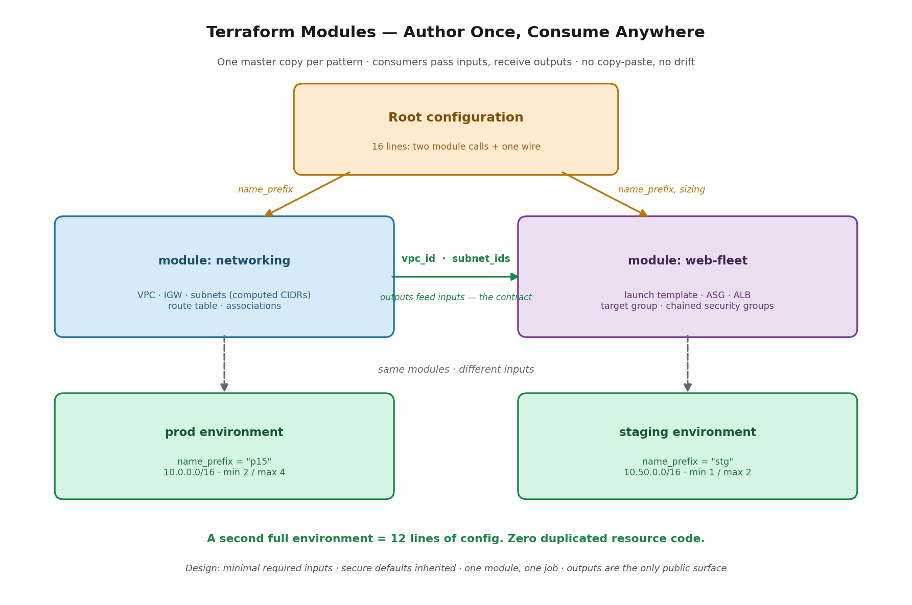

# Project 15 — Terraform Modules (Phase 1) · EKS + Observability (Phase 2, in progress)

**The problem:** A platform team keeps rebuilding the same infrastructure patterns — a VPC here, a web fleet there — by copying Terraform between projects. Every copy drifts. One environment ends up with an encrypted bucket and another doesn't; one has security groups chained correctly and another has 0.0.0.0/0 because someone was in a hurry. Standards live in people's heads and get re-litigated on every build. The team needs one blessed, versioned implementation of each pattern that every environment consumes — and consumers who can't accidentally skip the secure parts.

**Requirements:**
- Reusable modules with a clear input/output contract, not copy-pasted resource blocks
- Secure defaults (security-group chaining, least privilege) inherited automatically by every consumer
- A second environment must be standable from configuration alone — no duplicated resource code
- Consumers interact with validated variables, never with raw internals
- Each module does one job; composition happens in the root configuration



## What this demonstrates

Two authored modules — `networking` (VPC, IGW, computed subnets, routing) and `web-fleet` (launch template, Auto Scaling Group, ALB, target group, chained security groups) — plus a sixteen-line root configuration that composes them into a complete multi-AZ environment.

The root config is the whole argument. Two module calls and one wire:

```hcl
module "networking" {
  source      = "./modules/networking"
  name_prefix = "p15"
}

module "web_fleet" {
  source      = "./modules/web-fleet"
  name_prefix = "p15"
  vpc_id      = module.networking.vpc_id
  subnet_ids  = module.networking.public_subnet_ids
}
```

That `vpc_id = module.networking.vpc_id` line is outputs feeding inputs — the contract between modules, and the entire philosophy in one glance. Deployed 14 resources, served traffic across two AZs, and tore down clean.

**The proof of reuse:** standing up a completely separate staging environment — different CIDR (10.50.0.0/16), smaller fleet (min 1 / max 2) — took twelve additional lines of configuration and zero duplicated resource code. Plan confirmed 14 more resources from the same master copy.

## Decisions and trade-offs

**Minimal required inputs, sane defaults for the rest.** `name_prefix`, `vpc_id`, and `subnet_ids` are required, because only the consumer can know them. `instance_type`, `min_size`, and `max_size` ship with defaults, so the module works out of the box. Every additional required input is another way for a consumer to get it wrong — and every additional *optional* knob is surface area to maintain. Start minimal; add configurability when a real consumer actually needs it, not for hypothetical ones.

**Computed CIDRs instead of asked-for CIDRs.** The networking module derives subnet ranges from the VPC CIDR with `cidrsubnet()` rather than making the consumer supply them. Fewer inputs, fewer overlapping-subnet mistakes. The module absorbs the arithmetic so nobody else has to.

**Secure defaults baked in.** The security-group chain — web instances accept traffic *only* from the load balancer's security group, never from the internet — lives inside the module. A consumer inherits it automatically and cannot skip it. That's the difference between a standard that's written down and a standard that's enforced.

**One module, one job.** `web-fleet` takes a `vpc_id` and `subnet_ids`; it does not create networking. Separation of concerns means either module can be swapped, tested, or reused independently, and composition is the root config's job — not a module's.

**Outputs are the only public surface.** Consumers see `vpc_id`, `public_subnet_ids`, `alb_dns_name`, `asg_name`. Internals stay internal. This is the encapsulation argument, and it's least privilege applied to code: the smaller the surface a person can touch, the smaller the blast radius of any change.

**Scope calls — what the module deliberately does NOT do.** No scaling policies, no CloudWatch alarms, no monitoring. The module builds a fleet behind a load balancer; alerting policy belongs to the consumer, who knows their own thresholds. Knowing what to leave *out* of a module is half the judgment.

**Modules, not root-level resources — but not always.** The trigger is repetition: the moment I'm about to copy-paste Terraform, it belongs in a module. One master copy keeps every environment congruent, and versioning lets the master evolve without silently breaking consumers. The counter-case is real though — one-off infrastructure that's built once and never repeated gains nothing from module ceremony. Premature modularization is its own smell.

## What broke (and what it taught)

**"Module not installed."** Adding the staging module calls and running `plan` failed immediately: Terraform registers module calls at `init` time, so new calls mean the dependency graph changed and `terraform init` has to run again. Same family as the provider lock-file error from the serverless build. The rule generalizes: **init installs dependencies; plan only reads them.** Change the graph — add a module, add a provider, change a source — and init runs again. Removing module calls triggers it too, in the other direction.

## What I'd change at production scale

Version the modules with git tags and reference them by version (`source = "git::...?ref=v1.2.0"`) instead of a local path, so consumers upgrade deliberately rather than being broken silently by a change to the master copy. Publish each module with a README and a working example directory. Add input validation blocks so bad values fail at plan time with a readable message rather than at apply time with an AWS API error. Split state per environment (dev/stage/prod) rather than one state holding everything, and enforce conventions with policy-as-code (Sentinel/OPA) and required tags — the guardrails that matter once ten engineers are applying to the same infrastructure instead of one.

## Security · Monitoring · Cost

**Security:** the SG chain is inherited, not optional — consumers cannot deploy this fleet with instances exposed directly to the internet. **Monitoring:** deliberately left to the consumer; the module exposes `asg_name` so alarms can be attached externally. **Cost:** the environment exists only during work sessions and is destroyed in code afterward; fleet sizing is an input, so a staging environment runs min 1 while production runs min 2 — same module, right-sized per environment.

## PSIL

**Problem:** Copy-pasted infrastructure code drifts. Every duplicate is a future inconsistency, and every hand-edited resource block is a chance to break something in production.

**Solution:** Authored two Terraform modules with a clear input/output contract, secure defaults inherited by every consumer, and a thin root configuration that composes them — a master copy per pattern instead of copies per project.

**Impact:** A complete second environment — separate VPC, separate fleet, different sizing — stands up from twelve lines of configuration with zero duplicated resource code. Standards are enforced by the module rather than remembered by the engineer, and the blast radius of a change shrinks from forty lines of resources to a handful of validated inputs.

**Learning:** The trigger for a module is repetition, and the value is congruence — one master copy, versioned, so it can improve without breaking its consumers. But the judgment is in restraint: minimal inputs, one job per module, and no module at all for infrastructure that's built once.

---

**Phase 2 (in progress):** EKS cluster with a modularized deployment, Prometheus and Grafana for observability, and IRSA/OIDC so pods assume IAM roles instead of holding credentials.
