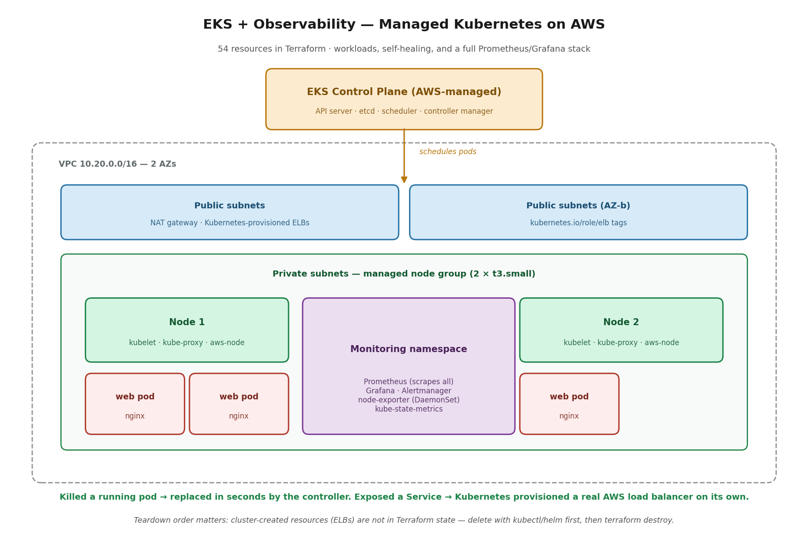

# Project 15 — Terraform Modules + EKS with Observability

**The problem:** Two problems, one project. First: a platform team keeps copy-pasting Terraform between environments, and every copy drifts — one has encrypted storage, another doesn't; one chains its security groups, another has 0.0.0.0/0 because someone was in a hurry. Second: the company runs containers on individual servers, deploying and restarting by hand, and when a container dies at 2am a human gets paged. They need reusable infrastructure patterns and a platform that schedules, heals, and reports on itself.

**Requirements:**
- Reusable modules with a clear input/output contract — no copy-pasted resource blocks
- Secure defaults inherited automatically by every consumer
- A managed Kubernetes cluster, provisioned entirely in Terraform, workers in private subnets
- Workloads that self-heal without human intervention
- Full observability: metrics from every node and pod, dashboards, alerting
- Everything destroyable and rebuildable from code — this stack bills by the hour

## Phase 1 — Authored Terraform modules

Two modules: `networking` (VPC, IGW, computed subnets, routing) and `web-fleet` (launch template, Auto Scaling Group, ALB, target group, chained security groups). A sixteen-line root configuration composes them into a complete multi-AZ environment.

The whole argument is in the root config: two module calls and one wire — `vpc_id = module.networking.vpc_id`. Outputs feeding inputs. That's the contract.

**The proof of reuse:** standing up a completely separate staging environment — different CIDR, smaller fleet — took twelve additional lines of configuration and zero duplicated resource code.

**Design decisions:**
- **Minimal required inputs.** Consumers supply only what they alone can know (name, VPC, subnets). Instance type and fleet sizing ship with working defaults. Every extra required input is another way to get it wrong.
- **Computed, not asked-for.** The networking module derives subnet CIDRs from the VPC CIDR with `cidrsubnet()` rather than making consumers do arithmetic they can get wrong.
- **Secure defaults baked in.** The security-group chain — instances accept traffic only from the load balancer's security group — lives inside the module. Consumers inherit it and cannot skip it. That's the difference between a standard that's written down and one that's enforced.
- **One module, one job.** `web-fleet` takes a VPC ID; it does not create networking. Composition belongs to the root config.
- **Outputs are the only public surface.** Internals stay internal — least privilege, applied to code.
- **When NOT to modularize:** one-off infrastructure. The trigger is repetition; premature modularization is its own smell.

## Phase 2 — EKS + Prometheus/Grafana

54 Terraform resources: VPC across two AZs, private subnets with NAT egress, a managed EKS control plane, a managed node group, and every IAM role and security group in between. Consumed the community VPC and EKS modules — nobody hand-writes 54 EKS resources, and consuming a versioned module is the other half of the skill Phase 1 taught from the authoring side.

**What EKS actually manages:** the control plane — API server, etcd, scheduler, controller manager — across multiple AZs, patched and backed up, for about $0.10/hour. What I still own: the nodes, the workloads, the networking, and the security posture. That distinction is what separates operating EKS from running minikube.

**Self-healing, verified:** deployed three replicas, watched the scheduler place them across both nodes, then deleted a running pod. A replacement was created within seconds — the controller manager comparing desired state (3) to actual (2) and closing the gap. No human, no page.

**Observability:** installed `kube-prometheus-stack` via Helm — Prometheus (scraping every node and pod), Grafana (29 dashboards), Alertmanager, node-exporter as a DaemonSet, and kube-state-metrics. One command, roughly fifty Kubernetes objects, versioned as a single release. Live CPU and memory graphs per node and per pod, inside minutes.

## Decisions and trade-offs

**EKS, not ECS/Fargate.** Honest version: most teams pick Kubernetes for reasons that are really about resumes rather than requirements. EKS earns its cost when you need the ecosystem (Helm, operators, Prometheus) or portability across clouds. ECS with Fargate is simpler and cheaper if you just need to run containers on AWS — no control-plane fee, no cluster to operate. EKS costs ~$100/month before a single pod runs. The right question is what problem is being solved, not which tool looks better on a resume.

**Managed node groups, not Fargate profiles.** Fargate removes the node layer entirely — no patching, no capacity planning, pay per pod. The cost is control: no DaemonSets, no privileged pods, no local storage — which rules out the node-exporter and Prometheus stack this project needed. EC2 node groups for control and steady load; Fargate for spiky, bursty workloads and small teams.

**Terraform, not eksctl.** eksctl spins up a cluster in one command. Terraform makes the cluster part of the same reviewed, versioned, plan-before-apply workflow as everything else — and composes with the modules from Phase 1.

**Helm charts, not raw YAML manifests.** Same trade-off as Terraform modules, one layer up the stack: consume a versioned, blessed package with your own values, rather than authoring fifty manifests and maintaining them. Raw YAML wins when you need total control or the chart hides something you need to reason about.

**Single NAT gateway, not one per AZ.** Production runs a NAT per availability zone so a zone failure doesn't strand the other zone's nodes. This runs one, saving ~$32/month. A deliberate lab trade-off, and a line in the production-scale section.

## What broke (and what it taught)

**1. "No data" on every utilization dashboard.** Grafana's CPU and memory utilization panels were blank. Monitoring wasn't broken — the pods had no resource requests set. Utilization is a ratio, and there was no denominator. Setting requests and limits (`kubectl set resources`) brought every panel to life.

The real lesson is bigger than the fix: pods without resource requests are invisible to the scheduler *and* to capacity planning. The scheduler places them blind, they can starve their neighbors, and nobody can answer "are we over-provisioned?" That's precisely how cloud bills balloon — and the follow-on finding proved it: once requests were set, memory utilization read 4.8%, meaning the pods were reserving roughly twenty times what they used. Reserved-but-unused capacity, multiplied across thousands of pods, is what FinOps teams exist to fix.

**2. Kubernetes created AWS infrastructure behind Terraform's back.** Exposing a Service as `type=LoadBalancer` caused Kubernetes to provision a real AWS load balancer — one that Terraform never created and doesn't have in state. On teardown, Terraform tries to delete the VPC and chokes on a load balancer it doesn't know about.

The rule: delete cluster-created resources with cluster tools first (`helm uninstall`, `kubectl delete svc`), *then* `terraform destroy`. Order matters. This is a real production trap and a good answer to "what surprised you about EKS."

**3. "Module not installed."** Adding module calls and running `plan` failed until `terraform init` ran again. Init installs dependencies; plan only reads them. Change the graph — add a module, add a provider — and init runs again. Same family as the provider lock-file error from the serverless build.

## What I'd change at production scale

Version the modules with git tags and reference them by version rather than local path, so consumers upgrade deliberately instead of being broken silently. NAT gateway per AZ. Private-only cluster endpoint with access through a bastion or VPN rather than a public endpoint. IRSA (IAM Roles for Service Accounts) so pods assume scoped IAM roles instead of inheriting node permissions — the OIDC provider is already created by the module, so this is the natural next step. Resource requests and limits enforced by admission policy, not left to whoever wrote the manifest. Prometheus with persistent storage and remote write, rather than in-cluster storage that dies with the pod. Alertmanager wired to a real paging destination.

## Security · Monitoring · Cost

**Security:** worker nodes in private subnets with NAT egress — they reach out, nothing reaches in. Security groups and IAM roles generated by the module rather than hand-rolled. The gap I'd close first in production is IRSA, so pods don't borrow node-level permissions. **Monitoring:** Prometheus scraping node-exporter and kube-state-metrics, Grafana dashboards for cluster, node, and pod resources, Alertmanager present and ready to route. **Cost:** EKS bills by the hour — control plane ~$0.10/hr plus nodes — so this environment exists only during work sessions and is destroyed in code afterward. Total cost of the build session: about a dollar. The deliverable is the repo, never a running bill.

## PSIL

**Problem:** Copy-pasted infrastructure drifts, and hand-operated container hosts require humans to notice failures and restart things. Neither scales past a small team.

**Solution:** Authored reusable Terraform modules with secure defaults and a clear contract; provisioned a managed EKS cluster entirely in code with workers in private subnets; deployed workloads that self-heal, and a Prometheus/Grafana stack that reports on every node and pod.

**Impact:** A second full environment now stands up from twelve lines of config with zero duplicated code. A deleted pod is replaced in seconds with no human involved. Cluster and workload metrics are visible in minutes, and the first thing they revealed was ~20x over-provisioning on memory — the exact category of waste that inflates cloud bills.

**Learning:** Modules and Helm charts are the same instinct at different layers — one master copy, versioned, so improvements don't break consumers. Managed Kubernetes hands you a control plane, not a free pass: the nodes, the networking, and the security posture are still yours. And a cluster will happily create cloud resources your IaC doesn't know about — which means teardown order is part of the design, not an afterthought.

I'd modularize the most-duplicated piece first, prove it on the lowest-stakes environment, then migrate the rest
