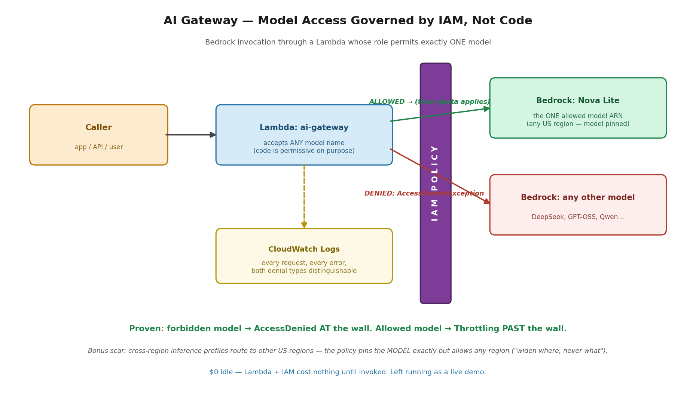

# Project 16 — AI Gateway: Bedrock Governed by IAM

**The problem:** A company wants AI in production — a support assistant, a summarizer. Security and legal ask three questions that kill most AI demos: Where does our data go? Who can invoke models, and can someone run up a five-figure bill on the biggest one? If something goes wrong, can we prove what was asked and answered? Most teams ship the demo and skip all three. This build answers them with the boring, load-bearing tools that already run the rest of the cloud: IAM, logging, and quotas.

**Requirements:**
- Model invocation stays inside the AWS account boundary — no third-party API keys, no data leaving
- Exactly one approved model is invocable, enforced by policy rather than trusted to application code
- Every request and every denial is logged and distinguishable
- $0 idle cost — the gateway exists without billing until called
- All of it in Terraform

## What this demonstrates

A Lambda "AI gateway" invokes Amazon Bedrock through an IAM execution role scoped to **exactly one model** — Nova Lite. The Lambda's code deliberately accepts *any* model name in its input. That's the design: the application layer is permissive on purpose, so the security boundary is provably the IAM policy and not a string check someone can edit.

**Verified both directions:**
- Requested a **forbidden model** (DeepSeek) through the gateway → `AccessDeniedException`, with the denial naming the exact model ARN refused and why: no identity-based policy allows the action. Stopped *at* the wall.
- Requested the **allowed model** (Nova Lite) → the request cleared the permission check and hit `ThrottlingException` — the account's Bedrock token quota — on the far side. Two different errors from two different layers, distinguishable in the logs. Throttling past the wall is itself proof the wall works.

## Decisions and trade-offs

**Bedrock, not a direct third-party API.** Calling OpenAI or Anthropic directly is simpler and often cheaper. Bedrock's price buys governance: data stays inside the account boundary, IAM controls invocation, CloudTrail records everything, and VPC endpoints can remove the public internet from the path entirely. Frequently the models are the same — what enterprises are purchasing is the compliance wrapper. And that wrapper is made of ordinary cloud primitives, which is the thesis of this project: **AI security is cloud security pointed at a new service.**

**Allow-listing by IAM, not by code.** The obvious implementation is an `if model not in ALLOWED` check in the Lambda. The problem: code is changed by whoever edits the function; the IAM policy is reviewed Terraform with a git history. Enforcement lives in the layer with the stronger change control. (AWS agrees — the Bedrock console's retired model-access page now says explicitly that administrators control model access through IAM policies and SCPs.)

**On-demand, not provisioned throughput.** Pay per token, scale to zero — the same economics as the serverless API project. Provisioned throughput buys guaranteed capacity at fixed hourly cost and wins only at steady, heavy volume.

**Small model by default.** Nova Lite class — cheap and fast. Defaulting to the biggest model is the same mistake as over-requesting pod memory: paying for capability the workload doesn't use.

## What broke (and what it taught)

**1. Account-wide throttling on the very first call.** Every model — Nova, OpenAI-OSS, DeepSeek — returned `ThrottlingException: too many tokens per day` before a single successful invocation. New accounts with no Bedrock history start with effectively zero inference quota. The investigation taught the quota taxonomy the hard way: Service Quotas lists ~97 Bedrock entries, and the ones named "(Model customization)" govern fine-tuning, not inference — reading the wrong family wastes an evening. Operational takeaway: **Bedrock capacity is quota-governed per model per account**, and "the model is down for us" usually means "we hit our token quota." AI platform teams manage this daily.

**2. The policy blocked a region I never asked for.** The allowed-model test initially failed with a denial for Nova Lite **in us-west-2** — while invoking from us-east-1. Cause: the `us.` prefix on the model ID is a *cross-region inference profile* — Bedrock routes the request to whichever US region has capacity, and it routed to Oregon, where the policy (scoped to us-east-1 ARNs) refused it. Fix: the foundation-model ARN's region became `*` while the model name stayed exact — **widen where, never what.** Still one model, any US region. Cross-region inference profiles are now a scar instead of a doc page.

## What I'd change at production scale

A VPC endpoint for Bedrock so invocation traffic never touches the public internet. CloudTrail data events for Bedrock invocations feeding an audit store — the "prove what was asked" requirement made durable. Bedrock Guardrails for input/output filtering (PII redaction, topic blocking) in front of the model. Cost controls beyond IAM: per-team invocation roles, budget alarms on Bedrock spend, and quota headroom monitoring. Map the whole control set to the OWASP LLM Top 10 — the IAM allow-list already addresses model supply-chain and excessive-agency categories; guardrails and logging cover prompt-injection detection and insecure-output handling.

## Security · Monitoring · Cost

**Security:** invocation permitted for exactly one model ARN, enforced in IAM with the application layer deliberately untrusted; trust policy limits role assumption to the Lambda service. **Monitoring:** CloudWatch logs capture every request and both denial types — AccessDenied (policy) and Throttling (quota) are distinguishable, which is the difference between a security event and a capacity event. **Cost:** Lambda + IAM = $0 idle; on-demand inference bills per token only when called. Left running as a live demo.

## PSIL

**Problem:** Companies adopting AI can't answer where their data goes, who can invoke which models, or what it will cost — and most reference architectures skip governance entirely.

**Solution:** An IAM-governed AI gateway: Lambda invoking Bedrock through a role scoped to a single approved model, with enforcement in reviewed Terraform rather than editable application code, and every outcome visible in logs.

**Impact:** Model allow-listing proven by test in both directions — a forbidden model denied by name at the policy layer, the approved model passing the permission check. Idle cost $0; the governance layer adds no infrastructure bill at all.

**Learning:** AI workloads are governed by the boring primitives — IAM, quotas, logs — which means cloud engineers already own most of the AI security problem. And two scars worth keeping: inference capacity is a per-account quota that can be zero on day one, and cross-region inference profiles will route requests to regions your policy never mentioned.
